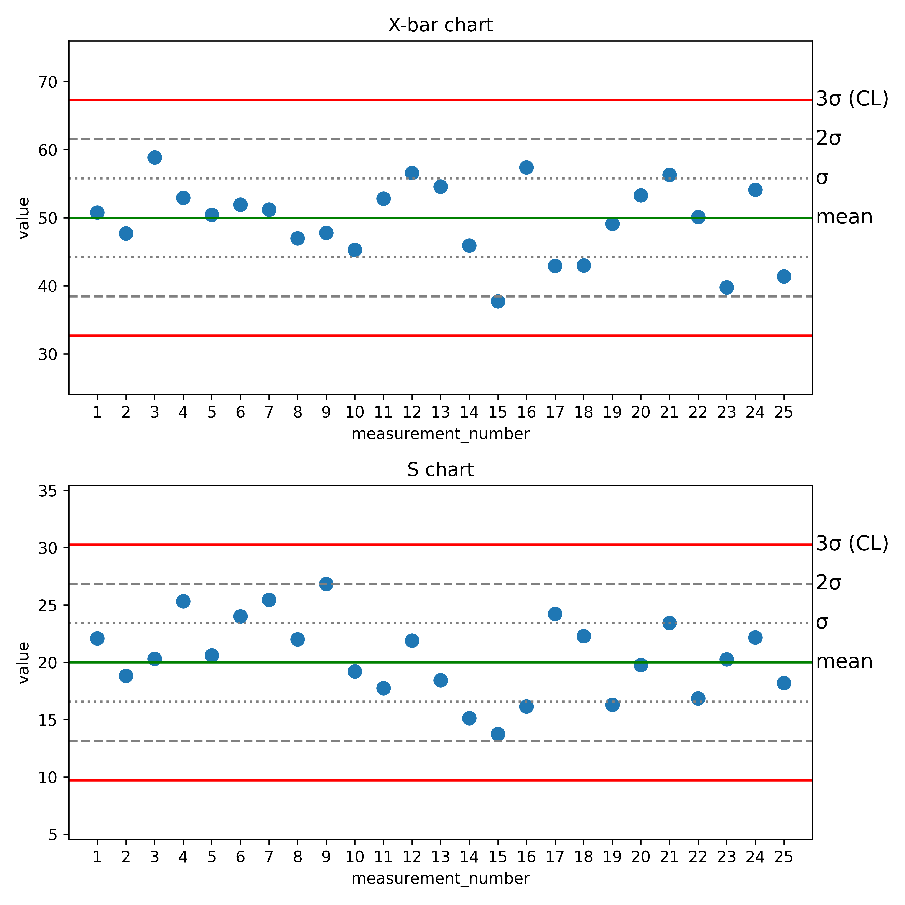

# Control_chart

In this mini project I wrote a function that generates an x-bar_s control chart. The chart is made based on an array with random values that are normally distributed. The array is a simulation of a process control - number of rows is number of measurements that will be displayed on the chart, and number of columns is a size of a subgroup in evey measurement. The array is generated by the function and all the parameters (mean, standard deviation, array size) are definied by the user. x_bar chart shows means of every measurements and s chart standard deviation of every measurements.

# Example

Here is the chart for an array of random values with distribution N(50,20). The array size is 25x12, which indicates that 25 measurements will be ploted, and each measurement represent a mean value (or standar deviation on the s chart) of a subgroup consisting of 12 samples.

